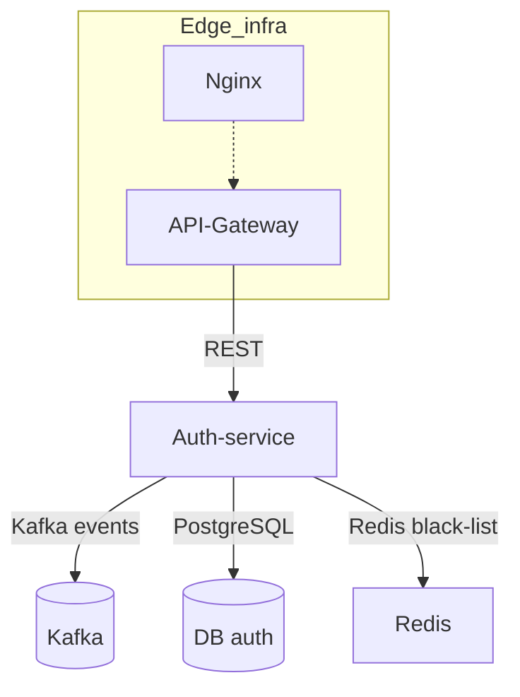
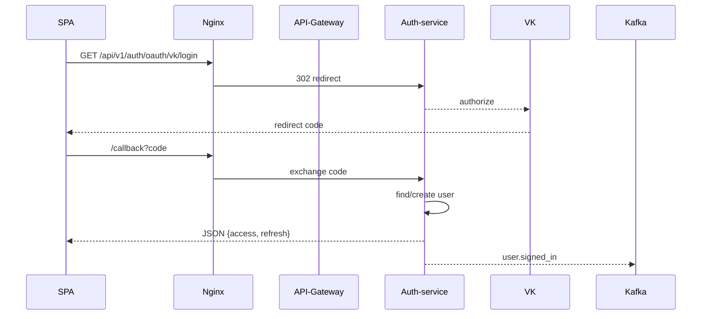

# Auth-service


### Архитектура



> [!NOTE]
>### REST‑API
>
> | HTTP  | Путь                           | Описание                                        | Токен      |
> |-------|--------------------------------|-------------------------------------------------|------------|
> | POST  | /api/v1/auth/signup            | Регистрация нового пользователя                 | —          |
> | POST  | /api/v1/auth/signin            | Логин, выдача access + refresh                  | —          |
> | POST  | /api/v1/auth/refresh           | Обновление access-токена по refresh             | refresh    |
> | POST  | /api/v1/auth/logout            | Инвалидация пары токенов                        | access     |
> | GET   | /api/v1/me                     | Короткая карточка «Я»                           | access     |
> | GET   | /api/v1/profile                | Полный профиль                                  | access     |
> | PUT   | /api/v1/profile                | Сохранение профиля                              | access     |
> | GET   | /api/v1/avatar/presign         | Presigned-URL для загрузки аватара в S3         | access     |


### Вход через Yandex ID, VK ID, APPLE ID




### Подключение к `KulturaGo_infostructure`

```bash
docker network inspect backend >/dev/null 2>&1 || \
  docker compose -f ../KulturaGo_infostructure/docker-compose.yml up -d

make dev
```

```
git clone https://…/KulturaGo_Auth-service.git
cd KulturaGo_Auth-service
cp .env.example .env                    
make dev                                 
open http://localhost:8080/swagger/index.html
```

### migrations

```shell
docker exec -i kulturago_auth-service-postgres-1 psql \
      -U root \
      -d postgres \
      < ./db/migrations/0001_init.up.sql
```

## Redactor:
- **Finnik**