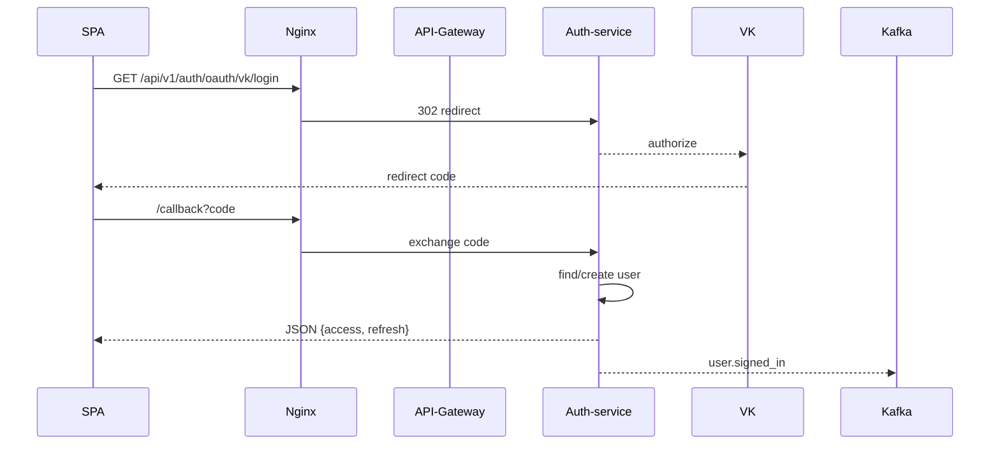

#KulturaGo BackEnd


## Структура проекта


```
KulturaGo_Auth-service/
├── .env.example
├── Makefile
├── Dockerfile
├── docker-compose.yml
├── db/
│   ├── migrations/
│   │   ├── 0001_init.up.sql
│   │   └── 0001_init.down.sql
│   └── goose.conf
├── api/
│   └── docs/             
├── cmd/
│   └── auth/
│       └── main.go
├── internal/
│   ├── domain/
│   │   └── user.go
│   ├── repository/
│   │   └── pg.go
│   ├── service/
│   │   └── auth.go
│   ├── tokens/
│   │   └── manager.go
│   ├── kafka/
│   │   └── producer.go
│   ├── middleware/
│   │   └── jwt.go
│   └── handler/
│       ├── http/         # SignUp / SignIn / OAuth
│       │   ├── auth.go
│       │   ├── oauth.go
│       │   └── init.go
│       └── routes/
│           └── router.go
├── go.mod
└── README.md
```


### Архитектура

```mermaid
graph TD
  subgraph Edge (infra)
    Nginx -.-> API_GW[API‑Gateway]
  end
  API_GW -->|REST| Auth(Auth‑service)
  Auth -->|Kafka events| Kafka[(Kafka)]
  Auth -->|PostgreSQL| PG[(DB auth)]
  Auth -->|Redis black‑list| Redis
```

### REST‑API


```mermaid
| POST /api/v1/auth/signup | регистрация по e‑mail/паролю |
| POST /api/v1/auth/signin | логин, JSON → access_token |
| GET  /api/v1/auth/oauth/vk/login | OAuth redirect |
| GET  /api/v1/auth/oauth/vk/callback | JWT | refresh |
| GET  /api/v1/me (JWT) | профиль (демо) |
```


### Поток «Social Login»





### Подключение к `KulturaGo_infostructure`

```bash
docker network inspect backend >/dev/null 2>&1 || \
  docker compose -f ../KulturaGo_infostructure/docker-compose.yml up -d

make dev
```

```
git clone https://…/KulturaGo_Auth-service.git
cd KulturaGo_Auth-service
cp .env.example .env                    
make dev                                 
open http://localhost:8080/swagger/index.html
```

### migrations

```shell
docker exec -i kulturago_auth-service-postgres-1 psql \
      -U root \
      -d postgres \
      < ./db/migrations/0001_init.up.sql
```

## Redactor:
- **Finnik**